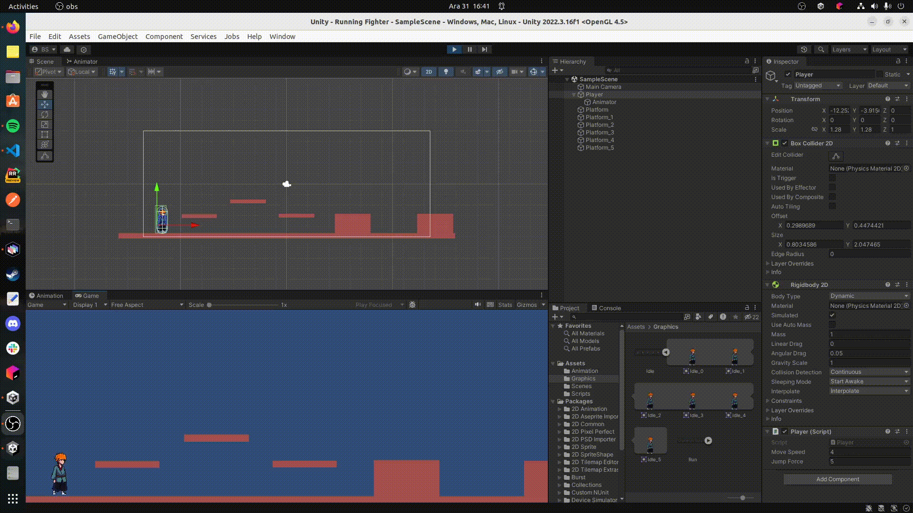

# Unity Çalışmaları

Bu repoda unity öğrenirken ki çalışmalara yer vermekteyim.

- **Running Fighter :** Bu örnekte 2D platformda sağa sola koşturup zıplayan bir karatecinin kullanımı söz konusu. Grafik nesnelerin bir sprite ile ilişkilendirilmesi, bir animasyonu oluşturan sprite sheet'lerin hareketlere bağlı olarak ayarlanması, aminasyon serilerinin uygulanması, karakter hareketleri için klavyeden alınan komutlara göre kod tarafında düzenlemeler yapılması gibi konuları öğrendim. Son eklemelerle birlikte karakterin sonsuza kadar değil bir sefer zıplaması, yürüme ve koşma işlevselliklerinin ayrılması ve duvarlara denk geldiğinde yapışmadan hemen aşağıya inmesi (Pyhsics Material kullanılarak) gibi düzeltmeler yapıldı.

